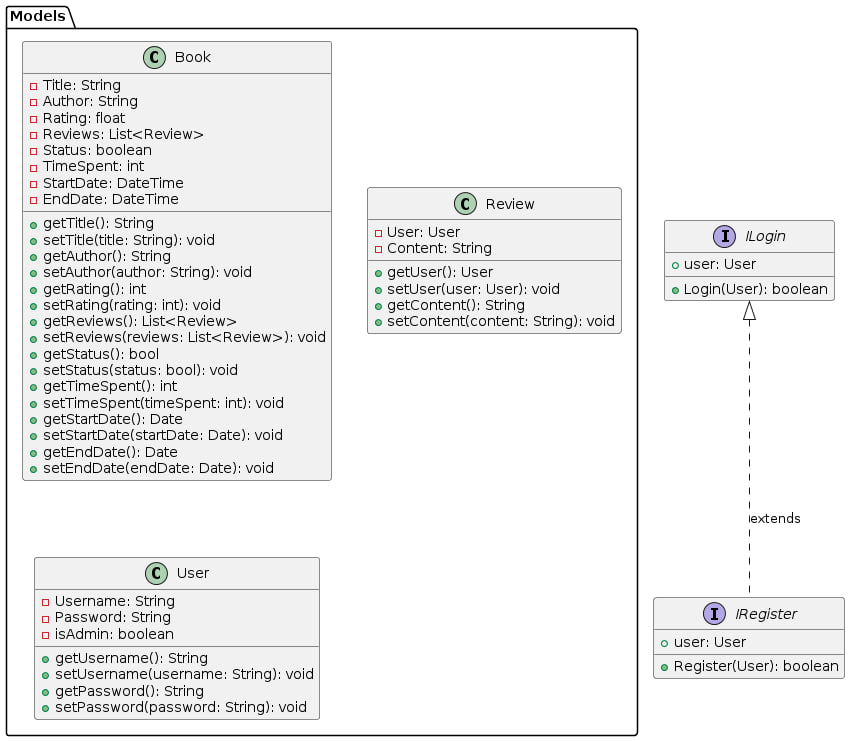

[](https://classroom.github.com/a/4zK3HDh5)



## UML Diagram of Project
```java
@startuml

package "Models" {
    class Book {
        - Title: String
        - Author: String
        - Rating: float
        - Reviews: List<Review>
        - Status: boolean
        - TimeSpent: int
        - StartDate: DateTime
        - EndDate: DateTime

        + getTitle(): String
        + setTitle(title: String): void
        + getAuthor(): String
        + setAuthor(author: String): void
        + getRating(): int
        + setRating(rating: int): void
        + getReviews(): List<Review>
        + setReviews(reviews: List<Review>): void
        + getStatus(): bool
        + setStatus(status: bool): void
        + getTimeSpent(): int
        + setTimeSpent(timeSpent: int): void
        + getStartDate(): Date
        + setStartDate(startDate: Date): void
        + getEndDate(): Date
        + setEndDate(endDate: Date): void
    }

    class Review {
        - User: User
        - Content: String

        + getUser(): User
        + setUser(user: User): void
        + getContent(): String
        + setContent(content: String): void
    }

    class User {
        - Username: String
        - Password: String
        - isAdmin: boolean

        + getUsername(): String
        + setUsername(username: String): void
        + getPassword(): String
        + setPassword(password: String): void
    }
}

interface ILogin {
    + user: User
    + Login(User): boolean
}

interface IRegister {
    + user: User
    + Register(User): boolean
}

ILogin <|.. IRegister : extends

@enduml
```